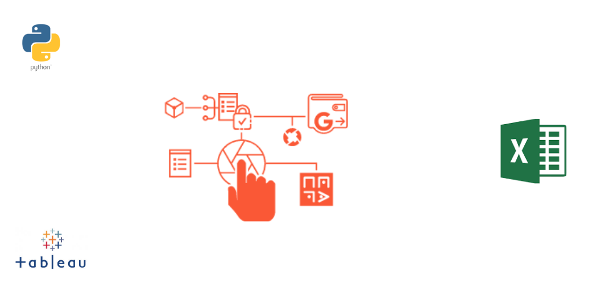

# Corporate data provider

Company installs IOT devices in customers houses collecting a range of broadband related performance data.  The company collects, collates and adds intelligence to this raw data, selling the insights to their customers.

Installation of a private and branded dataHut allowed the Company decrease friction in their data delivery to end customers, improved data delivery security, trace-ability and simplified the billing process. Decreasing costs of delivery and driving scale-ability.

Customers can more easily access datasets, thus increasing the data utility, and ultimately revenue.

