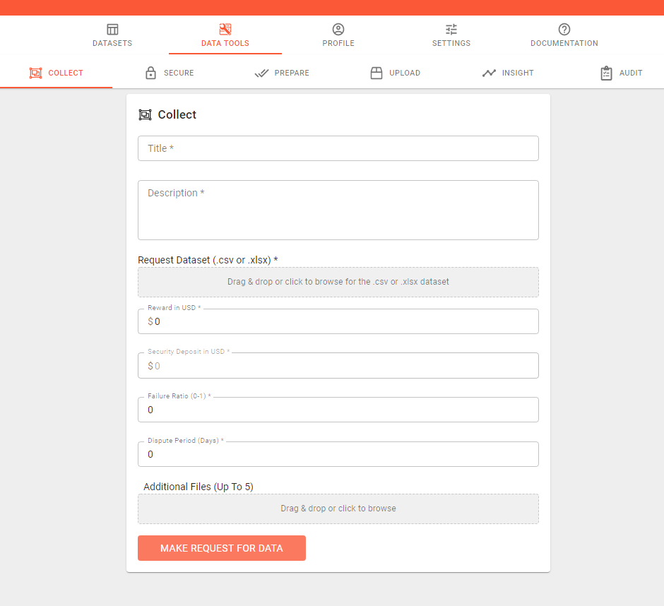

# Connection Types

## 1. Dialogflow Integration

### **Requirements** 

Before proceeding, you will need:

* A [Hut34](https://platform.hut34.io/Account/Login) account;
* A [Dialogflow](https://dialogflow.com/) account;
* To be familiar with Dialogflow.

Get started with Dialogflow [here](https://dialogflow.com/docs/getting-started).

### Obtain a Dialogflow agent client access token 

* Login to your Dialogflow account and select the agent that you want to integrate with Hut34.
* Go to your agent settings and copy "Client access token". This token will be used in the next step. 


### Register a new device in Hut34

* Now login to your Hut34 account. Click ["Register a Device"](https://platform.hut34.io/Registration/Create) link at the top of the page.
* Complete device information. Select "Dialogflow" under "Connection Types".
* Paste the "Client access token" copied from step 1 to the "API key" textbox.


* Press the "Register" button. You will now be redirected to the "Device List" page and you should now see your device in this list. Copy your "Device key" from this list. This will be used in the next step.


### Configure the Dialogflow webhook

* In your Dialogflow account select the agent that you want to integrate with the hut34 platform, and click on the "Fulfillment" link.
* Enable webhook and enter the webhook url by inserting your Device Key in the following url:

> [https://platform.hut34.io/botquery?platform=apiai&key=\[YOUR\_DEVICE\_KEY\]](https://platform.hut34.io/botquery?platform=apiai&key=[YOUR_DEVICE_KEY])



### Create Receiving Intent

* Create a new Intent in your agent and set "@hut34" in the "User Says" field.
* Under Fulfillment section enable the "Use Webhook" option.


## 2. AllThingsTalk Integration

### Requirements 

The Hut34 Platform supports [AllThingsTalk ](https://www.allthingstalk.com/)integration. You can integrate an AllThingsTalk \(ATT\) device by following these steps.

Before proceeding, you will need:

* A [Hut34](https://platform.hut34.io/Account/Login) account
* A [AllThingsTalk](https://www.allthingstalk.com/) account

### Obtain AllThingsTalk Device ID and Device Token

* Login to your AllThingsTalk account and select the device you wish to connect to Hut34
* Click on settings


* From the settings side bar, select Authentication.  Keep this tab open.


### Register a new device on Hut34 Platform

* From your Hut34 account, click on "Register a Device" link at the top of the page.
* Complete device information and select "AllThingsTalk" under "Connection Type".
* Copy and paste the Device ID and Device Token from ATT that you found during step 1.


### How it works

* Even though device data may be streamed continuously to ATT, Hut34 will only retrieve data upon request.
* When your data is requested, Hut34 will make an API request to ATT retrieve your device’s state.
* The response JSON from ATT will be parsed and returned to the requester.

## 3. Microsoft Bot Framework Integration 

### Register a new device in Hut34 

* Login to your Hut34 account. Click on "Register a Device" link at the top of the page.
* Enter device information \("device name", "invocation" and "entropy fee" per transaction\). Now select "MS Bot Framework" under "Connection Type".
* Enter your bot's webhook url.


* Press the "Register" button. You will be redirected to the "Device List" page. Now copy your device key. This will be used in next step.


### Send a message to the Hut and get a response

Sending your question to Hut34 and getting responses is simple. To send your question you need to post a JSON to your Hut34. You can use following Payload class.

```javascript
    public class Payload {
      public string message { get; set; }
    }
```

You will need to post your JSON to the following url by replacing \[DEVICE\_KEY\] with the key that you found from the previous step.

> [https://platform.hut34.io/botquery?platform=msft&key=\[DEVICE\_KEY\]](https://platform.hut34.io/botquery?platform=msft&key=[DEVICE_KEY])

Here is the the complete code in C\#:

```csharp
var client = new WebClient();
        client.Headers[HttpRequestHeader.ContentType] = "application/json";
        var json = JsonConvert.SerializeObject(new Payload { message = "what is day today." });
        string response = client.UploadString("https://platform.hut34.io/botquery?platform=msft&key=[Device_Key]", json);
```

Your query will be processed by the platform. Hut34's response will be sent back to you in the following JSON format.

```javascript
    {
        {
        "id": "b224cad-7337-448b-82dd-5ce6d77a755",
        "timestamp": "17-11-2017 11:35:42",
        "message": "response from hut34",
        "response": {
            "source": "source of response",
            "resolvedQuery": "original query",
            "isComplete": true
        },
        "input": {
            "source": "calling bot",
            "Key": "35686e7518v74dabnvbbd9224acd8d"
        },
        "status": {
            "code": 2,
            "type": "success"
        },
        "error": {
            "code": 1,
            "description": ""
        }
    }
```

### Replying to questions sent by Hut34

To reply questions sent by Hut34, you will need to create a webhook that listens to questions posted by the platform and send back a reply. Hut34 will post the following JSON to your webhook:

```javascript
  {
    "message": "Insert your query here."
  }
```

You can get questions from message attribute and send response back by responding with the same JSON after populating your answer in the message attribute. You can use the Payload class \(provided above\) to process the JSON if you want. Webhooks can be created in different ways by extending the WebHookHandler class and overriding the ExecuteAsync method. You can also write a custom method code to handle post requests in Global.asax class.  


## 4. Generic Webhook Integration

 The Hut34 Platform natively supports AllThingsTalk, Dialogflow and Microsoft Bot framework. It also supports custom integrations using generic webhooks. You can integrate your bot or device with the Hut34 Platform using generic webhooks.

### Register new device on Hut34

* Login to your Hut34 account. Click on"Register a Device" at the top of the page.
* In device registration, enter the device name and other requested details. Now select "Generic Webhook" under "Connection Type".
* Enter your device's webhook url.


* Press the "Register" button. You will be redirected to the device list page and you should now see your device listed. Now copy your "Device Key" from device list. This will be used in the next step.


### Post query to Hut34 and get response

 Sending your query to Hut34 and receiving a response is straightforward. To send your question you need to post the following JSON to Hut34.

```javascript
{
  "message": "Insert your query here."
}
```

You will need to post your JSON to the following url by replacing \[DEVICE\_KEY\] with the key that you got from the previous step.

> `https://platform.hut34.io/botquery?platform=gen&key=[DEVICE_KEY]`

Make sure to set the 'Content-Type' header to 'application/json'.

```javascript
{
  "message": "Hut34 response."
}
```

 Your query will be processed by the platform. Hut34's response will be sent back to you in the following JSON format.

```javascript
 {
        "id": "b224cad-7337-448b-82dd-5ce6d77a755",
        "timestamp": "17-11-2017 11:35:42",
        "message": "response from hut34",
        "response": {
            "source": "source of response",
            "resolvedQuery": "original query",
            "isComplete": true
        },
        "input": {
            "source": "calling bot",
            "Key": "35686e7518v74dabnvbbd9224acd8d"
        },
        "status": {
            "code": 2,
            "type": "success"
        },
        "error": {
            "code": 1,
            "description": ""
        }
    }
```

### Replying to questions sent by Hut34

 To reply to questions sent by Hut34 you will need to create a webhook that listens to questions posted by hut34 and sends back a reply. Hut34 will post the following JSON to your webhook:

```javascript
  {
    "message": ""
    }
```

 You can get questions from message attribute and send a response back by responding with the same JSON format after populating your answer in the message attribute.

