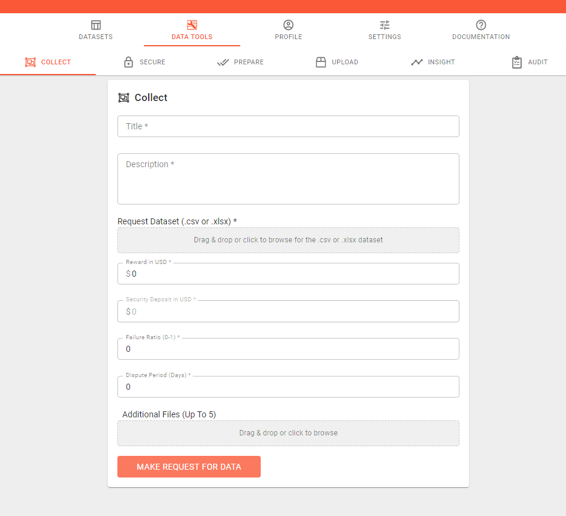

# Request For Data

In additon to packaging data for secure selling and sharing, the hutX protocol and dataHut allows users to make specific request for data and datasets. We call these a Request for Data \(RFD\)

RFDs can be accessed under the 'Collect' tab.

**Title and Description**

These fields are used to tell a potential RFD responder \(“Seller”\) the specifics of the information you are requesting to buy.

You can put anything here, it could be one sentence, or it could be the required dataset template. The more details you can supply the easier it will be for a Seller to complete the RFD.

To ensure chances for disputes are minimal and to get the best response possible, you should describe how you will determine if a response meets your benchmark for acceptance.


RFDs can be fulfilled by any approved Seller on a first come, first serve basis. So remember to ensure your RFD description is as specific as possible


**Reward**  
A fulfillment Reward is the amount \(USD\) you agree to pay the Seller upon the successful completion of your RFD.

When you submit your RFD you will be charged the fullfilment reward amoun. This amount remains locked in escrow until the RFD is both fulfilled and any dispute period has ended

\*Once a RFD is fulfilled, the Fullfilment Reward amount is NOT refundable.

**Security Deposit**

In order to respond to a RFD, any potential Seller must deposit a security deposit amount set by the data buyer. This is called a "stake"

By making this deposit or “stake”, data Sellers have "skin in the game" to ensure the quality of any information they submit is of the highest order.

When a Seller deposits the required "stake", they agree to give the data Buyer the right to destroy this amount. This 'at risk' amount serves to protect Buyers from poor or dishonest Seller fulfillment by enabling them to directy penalise a Seller that provides false, incorrect, or low-quality information.

**Penalty Ratio**

When making a RFD, data buyers, are also required to also set a Penalty Ratio.

This ratio \(combined with the Security Deposit\), is designed to ensure that both the transaction participants; data Buyers and data Sellers act fairly thoughout the entirety of a data transaction.

In the case a data Buyer exercises their right to destroy the Sellers stake, or a portion thereof,  an equivalent amount of their payment Reward is destroyed; as agreed in the Penalty Ratio. The Penalty Ratio ensures the Buyers right to destroy a Sellers stake is not abused as there is a direct cost to the Buyer if they choose to exercise it.


An example: 

If a data Buyer is dissatisfied with delivery and the stake is $500, the Penalty Ratio 0.1, and the Buyer elects to penalise the Seller for $100 from the stake: exercising this right will cost the $100\*0.1 = $10


**Acceptance Period** 

The Acceptance Period is the amount of time that a data Buyer has to verify and accept \(or penalise\) the quality of the information delivered by the Seller.

Within this period, a data Buyer may dispute the transaction, the fulfiller’s stake if they are dissatisfied, but after this period of time,

If the information included in the fulfillment is deemed to be satisfactory and the stake held in escrow released.

The requester can decide to release the stake early if they are satisfied with the submission.

\*\*\*\*

